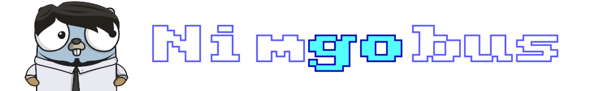

# 

An [Ebiten](https://ebiten.org/) extension for creating Go applications with an RM Nimbus look and feel.

Disclaimer: Nimgobus is a tribute project and is in no way linked to or endorsed by RM plc.

## Example

This is a minimal example that draws a Nimbus screen with a greeting and scales it to the ebiten screen size.

```go
package main

import (
	_ "image/png"
	"log"

	"github.com/adamstimb/nimgobus"
	"github.com/hajimehoshi/ebiten"
)

const (
	screenWidth  = 1200
	screenHeight = 800
)

// Declare a global Nimbus
var (
	nim nimgobus.Nimbus
)

type Game struct {
	count int
}

func Example() {
	// Draw some stuff on the Nimbus
	nim.SetMode(40)
	nim.SetBorder(10)
	nim.SetPaper(1)
	nim.Cls()
	nim.PlonkLogo(1, 1)
	nim.Plot("Nim  bus", 49, 149, 3, 3, 9)
	nim.Plot("   go", 49, 149, 3, 3, 13)
}

func (g *Game) Layout(outsideWidth, outsideHeight int) (int, int) {
	return outsideWidth, outsideHeight
}

func (g *Game) Update(screen *ebiten.Image) error {
    // Only draw the Nimbus screen once
    if g.count == 0 {
		go Test() 
	}
    g.count++
    // Update the Nimbus screen on each frame
	nim.Update() 
	return nil
}

func (g *Game) Draw(screen *ebiten.Image) {

	// Draw the Nimbus monitor on the screen and scale to current ebiten screen size.
	monitorWidth, monitorHeight := nim.Monitor.Size()
	// Calculate aspect ratios of Nimbus monitor and ebiten screen
	monitorRatio := float64(monitorWidth) / float64(monitorHeight)
	screenRatio := float64(screenWidth) / float64(screenHeight)
	// If screenRatio > monitorRatio then clamp monitorHeight to screenHeight otherwise
	// clamp monitorWidth to screenWidth
	var scale, offsetX, offsetY float64
	if screenRatio > monitorRatio {
		scale = float64(screenHeight) / float64(monitorHeight)
		offsetX = (float64(screenWidth) - float64(monitorWidth)*scale) / 2
		offsetY = 0
	}
	if screenRatio <= monitorRatio {
		scale = float64(screenWidth) / float64(monitorWidth)
		offsetX = 0
		offsetY = (float64(screenHeight) - float64(monitorHeight)*scale) / 2
	}

	// Apply scale and centre monitor on screen
	op := &ebiten.DrawImageOptions{}
	op.GeoM.Scale(scale, scale)
	op.GeoM.Translate(offsetX, offsetY)
	op.Filter = ebiten.FilterLinear
	screen.DrawImage(nim.Monitor, op)
}

func main() {

	// Initialize the new Nimbus
	nim.Init()
	// set up window
	ebiten.SetWindowSize(screenWidth, screenHeight)
	ebiten.SetWindowTitle("Nimgobus Test")
	// Call RunGame
	if err := ebiten.RunGame(&Game{}); err != nil {
		log.Fatal(err)
	}
}
```