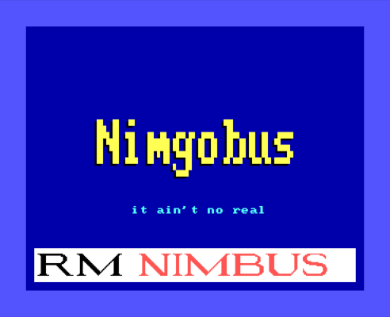

# 

An [Ebiten](https://ebiten.org/) extension for building retro apps and games in Go.

## About

Nimgobus is an extension of the excellent [Ebiten](https://ebiten.org/) game engine.  It mimicks the 16-bit graphics and text drivers of the [RM Nimbus PC186](https://en.wikipedia.org/wiki/RM_Nimbus), found in classrooms all over the UK in the 1980s and early 90s.  With Nimgobus you can develop Go applications that have the cheesey and often 'chromatically challenging' look and feel of classic Nimbus software such as PaintSPA, Ourfacts and Caxton Press.  However, it is _not_ an emulation of the Nimbus itself.  This means you get the best of both worlds:

- Cutting-edge Go computing power, beautifully presented in up to 16 colours
- Build for Linux, Windows, Mobile and Web thanks to Ebiten's cross-platform support
- Embed a Nimbus as a component within another user interface (if you really want to go nuts)

_Disclaimer: Nimgobus is a tribute project and is in no way linked to or endorsed by RM plc._

## Installation

[Install Ebiten](https://ebiten.org/documents/install.html) then simply get the Nimgobus extension:

```bash
$ go get github.com/adamstimb/nimgobus
```

## Example

This is a minimal example that draws a Nimbus screen with a greeting, the Nimbus BIOS logo with the paper and border in different shades of blue.  The Nimbus screen is also scaled to the ebiten screen size while maintaining the original aspect ratio.  Most of the code is for setting up and running an ebiten game and scaling the screen.  The function Example() contains the magic 1980s 16-bit sauce.



```go
package main

import (
	_ "image/png"
	"log"

	"github.com/adamstimb/nimgobus"
	"github.com/hajimehoshi/ebiten"
)

// Ebiten screen dimensions
const (
	screenWidth  = 1200
	screenHeight = 800
)

// Declare a global Nimbus variable
var (
	nim nimgobus.Nimbus
)

type Game struct {
	count int
}

func (g *Game) Layout(outsideWidth, outsideHeight int) (int, int) {
	return outsideWidth, outsideHeight
}

func (g *Game) Update(screen *ebiten.Image) error {
	if g.count == 0 {
		go Example() // Only draw the Nimbus screen once
	}
	g.count++
	nim.Update() // Redraw the Nimbus screen
	return nil
}

func Example() {
	// Do some Nimbus graphics
	nim.SetMode(40)  // Low-res, high-colour mode
	nim.SetBorder(9) // Light blue border
	nim.SetPaper(1)  // Dark blue paper
	nim.Cls()        // Clear screen
	// Plot some text with a shadow effect
	op := nimgobus.PlotOptions{
		SizeX: 3, SizeY: 6, Brush: 0
	}
	nim.Plot(op, "Nimgobus", 65, 150)
	op.Brush = 14
	nim.Plot(op, "Nimgobus", 67, 152)
	op.SizeX = 1
	op.SizeY = 1
	op.Brush = 13
	nim.Plot(op, "it ain't no real", 100, 70)
	nim.PlonkLogo(8, 8) // Draw the Nimbus BIOS logo
}

func (g *Game) Draw(screen *ebiten.Image) {

	// Draw the Nimbus monitor on the screen and scale to current window size.
	monitorWidth, monitorHeight := nim.Monitor.Size()
	// Calculate aspect ratios of Nimbus monitor and ebiten screen
	monitorRatio := float64(monitorWidth) / float64(monitorHeight)
	screenRatio := float64(screenWidth) / float64(screenHeight)
	// If screenRatio > monitorRatio then clamp monitorHeight to screenHeight otherwise
	// clamp monitorWidth to screenWidth
	var scale, offsetX, offsetY float64
	if screenRatio > monitorRatio {
		scale = float64(screenHeight) / float64(monitorHeight)
		offsetX = (float64(screenWidth) - float64(monitorWidth)*scale) / 2
		offsetY = 0
	}
	if screenRatio <= monitorRatio {
		scale = float64(screenWidth) / float64(monitorWidth)
		offsetX = 0
		offsetY = (float64(screenHeight) - float64(monitorHeight)*scale) / 2
	}
	// Apply scale and centre monitor on screen
	op := &ebiten.DrawImageOptions{}
	op.GeoM.Scale(scale, scale)
	op.GeoM.Translate(offsetX, offsetY)
	op.Filter = ebiten.FilterLinear
	screen.DrawImage(nim.Monitor, op)
}

func main() {

	// Initialize a new Nimbus
	nim.Init()

	// set up window
	ebiten.SetWindowSize(screenWidth, screenHeight)
	ebiten.SetWindowTitle("Nimgobus Example")

	// Call RunGame method, passing the address of the pointer to an empty Game struct
	if err := ebiten.RunGame(&Game{}); err != nil {
		log.Fatal(err)
	}
}

```

## Links

- Gopher generated by [gopherize.me](https://gopherize.me/)
- [Facebook](https://www.facebook.com/RMNimbus/) - RM Nimbus facebook group
- [Center for Computing History](http://www.computinghistory.org.uk/) - original RM Nimbus manuals and technical data
- [Center for Computing History - RM Nimbus PC (Later Beige Model)](http://www.computinghistory.org.uk/det/41537/RM-Nimbus-PC-(Later-Beige-Model)/) - online exhibit
- [The Nimbus Museum](https://thenimbus.co.uk/) - online museum that looks like the Welcome Disk!
- [RM Nimbus](https://en.wikipedia.org/wiki/RM_Nimbus) - Wikipedia article
- [mame](https://www.mamedev.org/) - comprehensive retro computer emulation project
- [Freesound pack: Floppy disk drive](https://freesound.org/people/MrAuralization/packs/15891/) - source of the floppy drive sounds
- [Nimusinator](https://github.com/adamstimb/nimbusinator) - similar package for Python and predecessor to Nimgobus
- [Ironstone Innovation](https://ironstoneinnovation.eu) - what I do for a living
