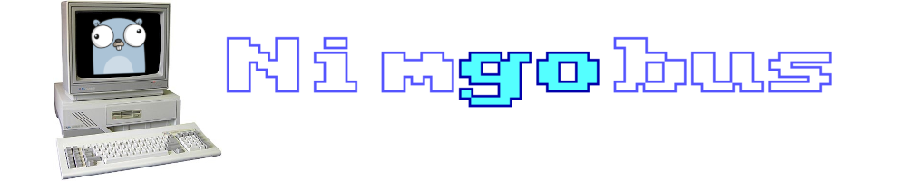

# 

An RM Nimbus-inspired [Ebiten](https://ebiten.org/) extension for building retro apps and games in Go.

_Nimgobus is a tribute project and is in no way linked to or endorsed by RM plc._

## About

Nimgobus is an extension of the [Ebiten](https://ebiten.org/) game engine.  It mimicks the unique 16-bit text, graphics and sound drivers of the [RM Nimbus PC186](https://en.wikipedia.org/wiki/RM_Nimbus), found in classrooms all over the UK in the 1980s and early 90s.  With Nimgobus you can develop Go applications that have the beautiful look and feel of classic Nimbus software such as PaintSPA, Ourfacts and Caxton Press.  However, it is _not_ an emulation of the Nimbus itself.  This means you get the best of both worlds:

- Cutting-edge Go computing power, beautifully presented in up to 16 colours
- Build for Linux, Windows, Mobile and WebASM thanks to Ebiten's cross-platform support

## Usage

Nimgobus generates a screen image that can be embedded in an Ebiten application.  First add Nimgobus to your Game struct:

```go
type Game struct {
	count           int
	// ...
	nimgobus.Nimbus // Embed the Nimbus in the Game struct
}
```

In your `NewGame()` function, initialize the Nimbus before sending any commands to it:

```go
func NewGame() *Game {
	game := &Game{}
	// ...
	game.Init() // Initialize Nimgobus
	return game
}
```

In the `Update()` function add a call to update the Nimbus monitor screen:

```go
func (g *Game) Update() error {
	// ...
	g.Nimbus.Update() // Update the app on all subsequent iterations
	// ...
	return nil
}
```

The Nimbus screen can be retrieved like this:

```go
img := g.Monitor
```

And commands sent like this:

```go
g.Subbios.TGraphicsOutput.FGraphicsOutputColdStart() // Start the graphics system
g.Subbios.TGraphicsOutput.FPlotCharacterString(0, 1, 2, 13, 0, "Hello there!", 0, 0) // Say hello
```

### API

Nimgobus is implemented with an API similar to the original Nimbus SUBBIOS which received function calls to the dedicated Nimbus IO drivers as CPU interrupts, with the parameters stored in various registers.  For the sake of simplicity Nimgobus uses conventional Go function arguments and return values.  Furthermore, the SUBBIOS includes a light implementation of an old-skool stdio C library for sending text data to the screen and receiving keyboard input.

## Acknowledgements

Shouts out to the following for their help and advice:

[Darren Smith](https://thenimbus.co.uk/), Tim Nuttal (formely RM, SPA), Tim Pearson (RM co-founder)

## Links

- Masthead gopher generated by [gopherize.me](https://gopherize.me/) and Nimbus photograph from [The Nimbus Museum](https://www.thenimbus.co.uk/range-of-nimbus-computers)
- [Ebiten](https://ebiten.org/)
- [Facebook](https://www.facebook.com/RMNimbus/) - RM Nimbus facebook group
- [Center for Computing History](http://www.computinghistory.org.uk/) - original RM Nimbus manuals and technical data
- [Center for Computing History - RM Nimbus PC (Later Beige Model)](http://www.computinghistory.org.uk/det/41537/RM-Nimbus-PC-(Later-Beige-Model)/) - online exhibit
- [The Nimbus Museum](https://thenimbus.co.uk/) - online museum that looks like the Welcome Disk!
- [RM Nimbus](https://en.wikipedia.org/wiki/RM_Nimbus) - Wikipedia article
- [mame](https://www.mamedev.org/) - comprehensive retro computer emulation project
- [Freesound pack: Floppy disk drive](https://freesound.org/people/MrAuralization/packs/15891/) - source of the floppy drive sounds
- [Nimbusinator](https://github.com/adamstimb/nimbusinator) - the Pythonic predecessor to Nimgobus
- [Ironstone Innovation](https://ironstoneinnovation.eu) - what I do for a living
